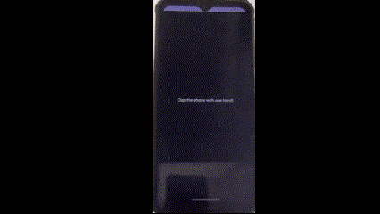

# Clap App

Clap App is a simple Android application that uses the device's proximity sensor to simulate clapping. 
By moving your hand near and away from the phone's proximity sensor, the app detects the gesture as a "clap" and displays a message.

## Features
- Detects a "clap" using the proximity sensor.
- Provides visual feedback when a clap is detected.

## Requirements
- Android device with a proximity sensor.
- Minimum SDK version: 24 (Android 7.0 Nougat)

## Demo

