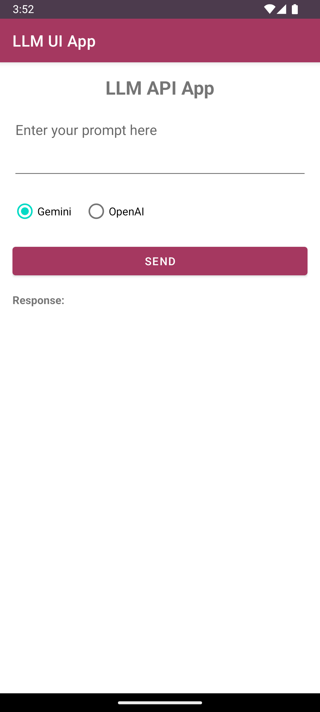
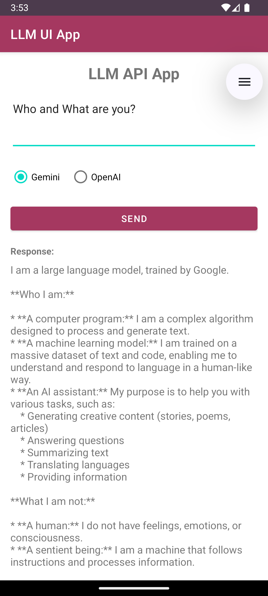
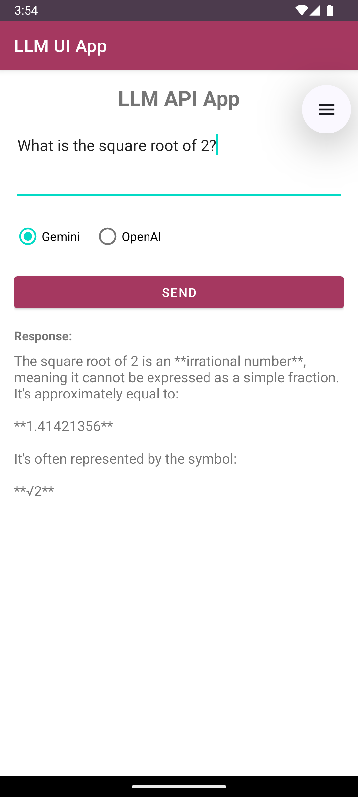
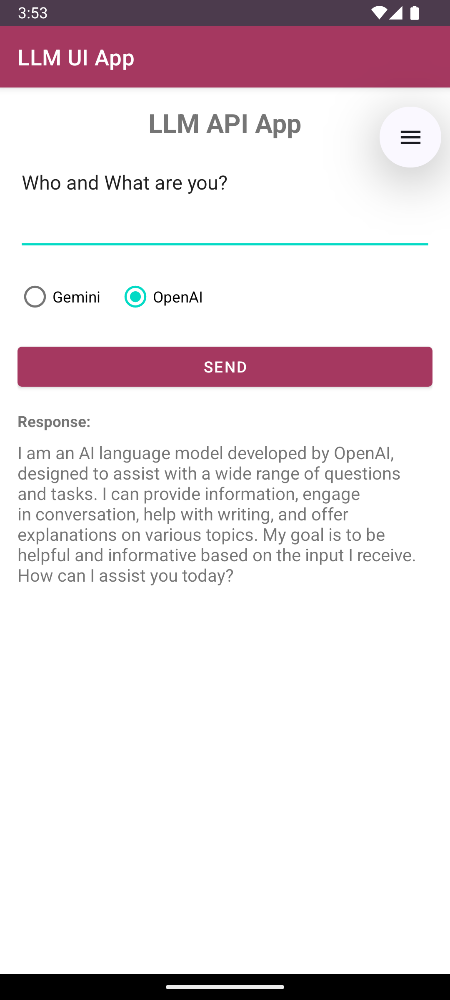
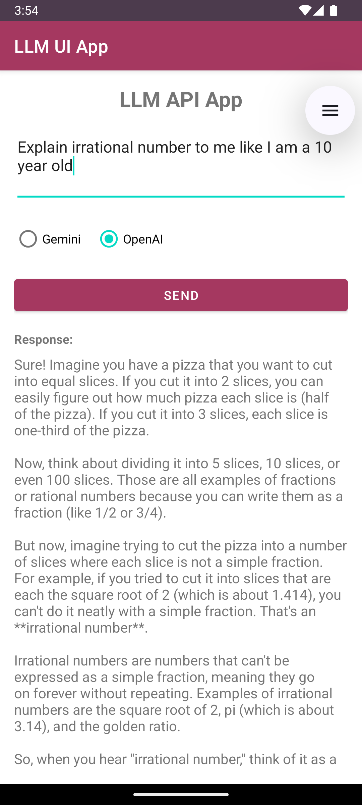

# Android LLM API App

This Android application demonstrates the use of Language Model APIs, specifically Google's Gemini API and OpenAI's API (via Azure). The app allows users to input prompts, choose between the two APIs, and receive AI-generated responses.

## Features

- User-friendly interface for entering prompts
- Option to choose between Gemini and OpenAI APIs
- Display of AI-generated responses
- Asynchronous API calls to prevent UI freezing

## Screenshots

### Main Screen

### Gemini API Response

### OpenAI API Response

## Installation

1. Clone this repository.
2. Open the project in Android Studio.
3. Replace the API keys in `MainActivity.java`:
    - Replace `YOUR_GEMINI_API_KEY` with your actual Gemini API key
    - Replace `YOUR_OPENAI_API_KEY` with your actual OpenAI API key
4. Build and run the application on an emulator or physical device.

## Usage

1. Launch the app on your Android device.
2. Enter your prompt in the text field.
3. Select either "Gemini" or "OpenAI" using the radio buttons.
4. Tap the "Send" button to submit your prompt.
5. The AI-generated response will appear in the scrollable text area below.
