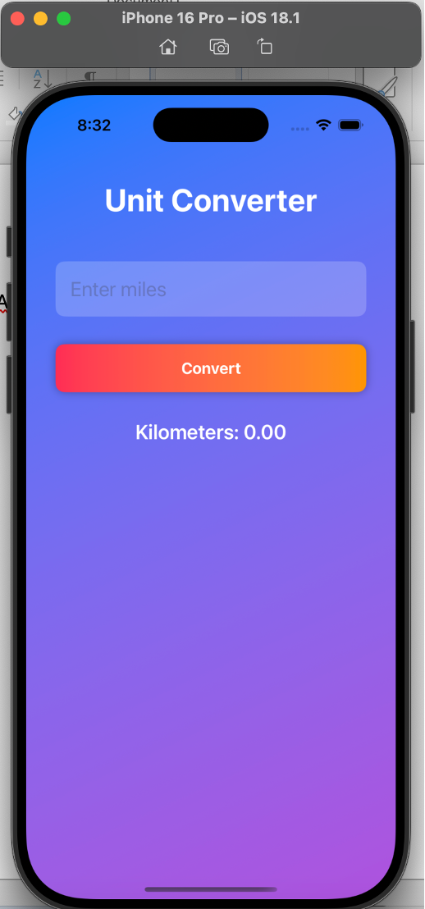
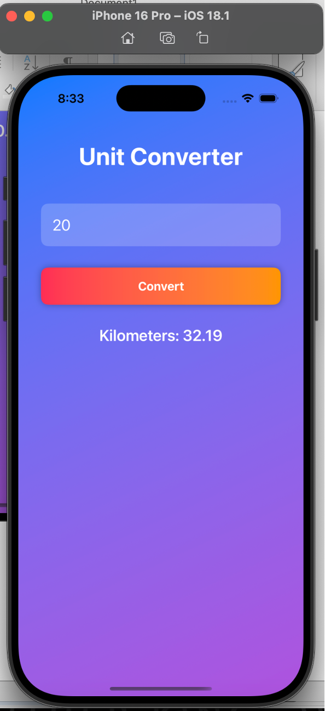

# Unit Converter

The Unit Converter is a simple application designed to convert distances from miles to kilometers.

## Installation
1. Ensure you have Xcode installed on your Mac.
2. Clone or download this repository.
3. Open the project in Xcode.
4. Run the project on a simulator or phone

## Screenshotss

